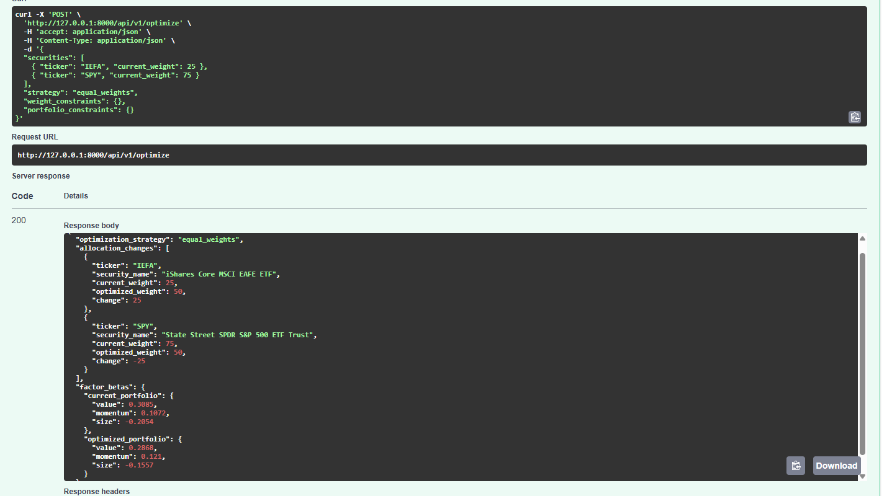
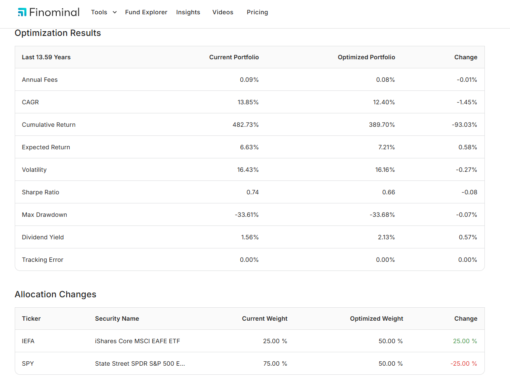
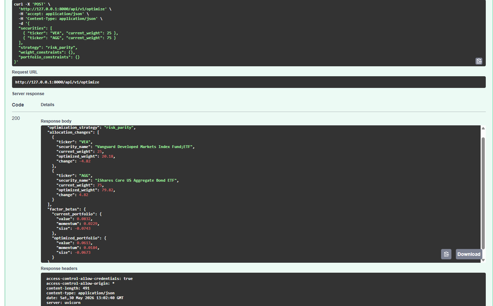
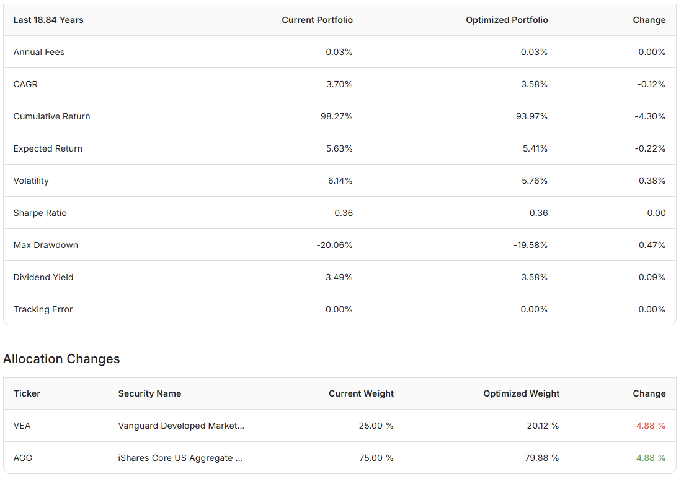
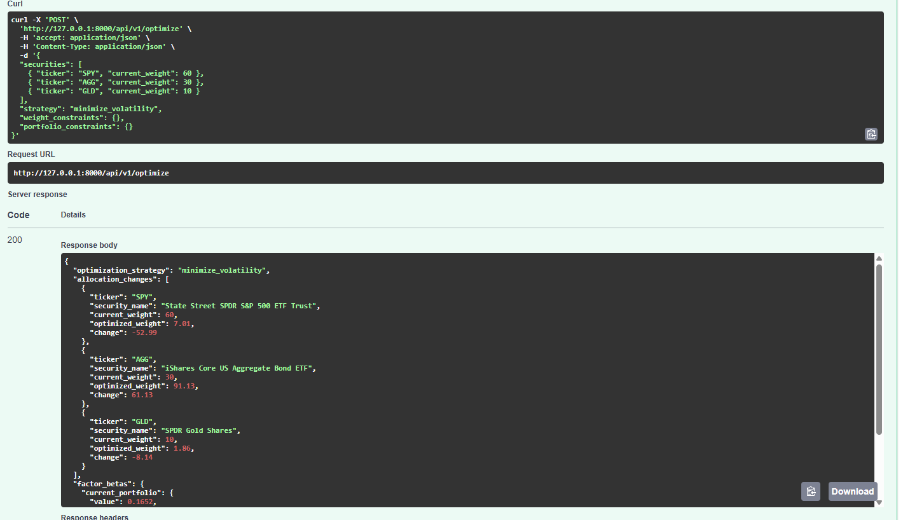
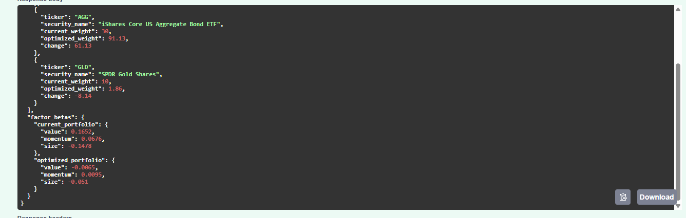
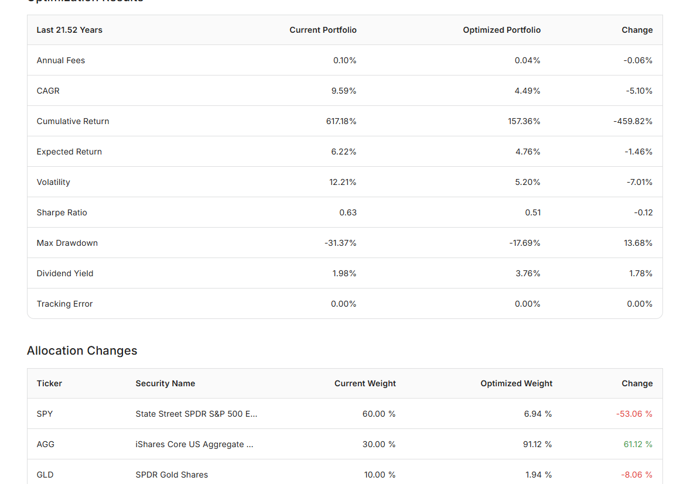

<div align="center" id="top">

<h1>Finominal Portfolio Optimizer</h1>

<p align="center">
  
  
  
  
  
  
  
</p>

<p align="center">
  <a href="#dart-about">About</a> &#xa0;|&#xa0;
  <a href="#sparkles-features">Features</a> &#xa0;|&#xa0;
  <a href="#rocket-tech-stack">Tech Stack</a> &#xa0;|&#xa0;
  <a href="#white_check_mark-requirements">Requirements</a> &#xa0;|&#xa0;
  <a href="#checkered_flag-getting-started">Getting Started</a> &#xa0;|&#xa0;
  <a href="#test_tube-test-scenarios">Test Scenarios</a> &#xa0;|&#xa0;
  <a href="#bulb-design-decisions">Design Decisions</a> &#xa0;|&#xa0;
  <a href="https://github.com/shiv1119" target="_blank">Author</a>
</p>

</div>

<hr>

## :dart: About

This project was built as part of a **Junior Backend Developer take-home assignment**. The goal was to replicate the core optimization engine behind [Finominal's Portfolio Optimizer tool](https://finominal.com/portfolio-optimizer/US).

The API accepts a list of fund tickers with their current weights and a chosen optimization strategy, then returns the optimally rebalanced portfolio weights — mirroring the output of the live Finominal tool.

I was provided with historical return data for 5 funds (**IEFA, SPY, GLD, VEA, AGG**), historical factor return data for Momentum, Value, and Size factors, and ticker/dividend yield metadata.

I chose **FastAPI** as the framework because of its built-in Pydantic validation, automatic Swagger docs, and async support — it was the most natural fit for a clean, quickly-testable API. The optimization math is handled via `scipy.optimize`, which gave me fine-grained control over solvers and constraint definitions.

The bonus **Factor Exposure** strategy is also implemented, including OLS regression-based factor beta calculations for both the current and optimized portfolio.

You can validate all outputs against the live tool at: https://finominal.com/portfolio-optimizer/US

<hr>

## :sparkles: Features

✔ **Equal Weights** — Simple baseline: equal allocation to all securities, always sums to 100%.<br>
✔ **Risk Parity** — Each security contributes equally to total portfolio risk, solved iteratively via SciPy.<br>
✔ **Minimize Drawdown** — Finds the allocation that minimizes the maximum historical drawdown.<br>
✔ **Minimize Volatility** — Finds the allocation with the lowest portfolio standard deviation.<br>
✔ **Maximize Sharpe Ratio** — Maximizes risk-adjusted return (risk-free rate assumed 0%).<br>
✔ **Optimize Factor Exposure** *(Bonus)* — Maximize or minimize exposure to Momentum, Value, or Size factors.<br>
✔ **Per-security weight constraints** — Enforce `min_weight` / `max_weight` per ticker.<br>
✔ **Portfolio-level constraints** — Enforce constraints like `min_dividend_yield` across the portfolio.<br>
✔ **Factor Beta output** *(Bonus)* — Returns OLS-computed factor betas for both current and optimized portfolios.<br>
✔ **Constraint validation** — Returns clear errors if constraints are infeasible rather than silently failing.<br>
✔ **Interactive Swagger docs** — Auto-generated at `/docs` for easy endpoint testing.<br>

<hr>

## :rocket: Tech Stack

| Tool | Purpose |
|---|---|
| [Python 3.10+](https://www.python.org/) | Core language |
| [FastAPI](https://fastapi.tiangolo.com/) | Web framework — fast to build, auto-generates Swagger docs |
| [Uvicorn](https://www.uvicorn.org/) | ASGI server to run FastAPI |
| [Pandas](https://pandas.pydata.org/) / [NumPy](https://numpy.org/) | Data loading and return series manipulation |
| [SciPy](https://scipy.org/) | Numerical optimization (SLSQP solver for all strategies) |
| [Pydantic](https://docs.pydantic.dev/) | Request/response validation |
| [openpyxl](https://openpyxl.readthedocs.io/) | Reading the Excel file with historical return and factor data |

<hr>

## :white_check_mark: Requirements

Before starting, make sure you have the following installed:

- [Git](https://git-scm.com)
- [Python 3.10+](https://www.python.org/)

<hr>

## :checkered_flag: Getting Started

```bash
# Clone the repository
git clone https://github.com/shiv1119/finominal-portfolio-optimizer.git

# Move into the project directory
cd finominal-portfolio-optimizer

# (Recommended) Create and activate a virtual environment
python -m venv venv
source venv/bin/activate          # On Windows: venv\Scripts\activate

# Install dependencies
pip install -r requirements.txt

# Start the development server
uvicorn app.main:app --reload
```

**The API will be available at:** `http://127.0.0.1:8000`

**Interactive Swagger docs:** `http://127.0.0.1:8000/docs`

<hr>

## :arrows_counterclockwise: API Endpoints

### Health Check — `GET /api/v1/health`

```bash
curl -X GET 'http://127.0.0.1:8000/api/v1/health' \
  -H 'accept: application/json'
```

---

### Available Funds — `GET /api/v1/funds`

Returns all supported fund tickers with security names and dividend yield data.

```bash
curl -X GET 'http://127.0.0.1:8000/api/v1/funds' \
  -H 'accept: application/json'
```

---

### Optimize Portfolio — `POST /api/v1/optimize`
## :test_tube: Test Scenarios

All six test cases from the assignment, validated against the live Finominal tool. Required cases 1–5 match the reference output within < 0.1% floating-point tolerance.

---

### Case 1 — Equal Weights (Sanity Check)
**Input:** IEFA: 25%, SPY: 75% &nbsp;|&nbsp; **Strategy:** Equal Weights

```bash
curl -X 'POST' \
  'http://127.0.0.1:8000/api/v1/optimize' \
  -H 'accept: application/json' \
  -H 'Content-Type: application/json' \
  -d '{
  "securities": [
    { "ticker": "IEFA", "current_weight": 25 },
    { "ticker": "SPY", "current_weight": 75 }
  ],
  "strategy": "equal_weights",
  "weight_constraints": {},
  "portfolio_constraints": {}
}'
```
<h2>Local Response Equal Weights</h2>

<p align="center">
  
</p>

<h2>Online Tool Equal Weights</h2>

<p align="center">
  
</p>

---

### Case 2 — Risk Parity
**Input:** VEA: 25%, AGG: 75% &nbsp;|&nbsp; **Strategy:** Risk Parity

```bash
curl -X POST 'http://127.0.0.1:8000/api/v1/optimize' \
  -H 'Content-Type: application/json' \
  -d '{
    "securities": [
      {"ticker": "VEA", "current_weight": 25},
      {"ticker": "AGG", "current_weight": 75}
    ],
    "strategy": "risk_parity",
    "weight_constraints": {},
    "portfolio_constraints": {}
  }'
```
<h2>Local Response Risk Parity</h2>

<p align="center">
  
</p>

<h2>Online Tool Risk Parity</h2>

<p align="center">
  
</p>

---

### Case 3 — Minimize Volatility
**Input:** SPY: 60%, AGG: 30%, GLD: 10% &nbsp;|&nbsp; **Strategy:** Minimize Volatility

```bash
curl -X 'POST' \
  'http://127.0.0.1:8000/api/v1/optimize' \
  -H 'accept: application/json' \
  -H 'Content-Type: application/json' \
  -d '{
  "securities": [
    { "ticker": "SPY", "current_weight": 60 },
    { "ticker": "AGG", "current_weight": 30 },
    { "ticker": "GLD", "current_weight": 10 }
  ],
  "strategy": "minimize_volatility",
  "weight_constraints": {},
  "portfolio_constraints": {}
}'
```
<h2>Local Response Minimize Volatility</h2>

<p align="center">
  
  
</p>

<h2>Online Tool Minimize Volatility</h2>

<p align="center">
  
</p>

---

### Case 4 — Maximize Sharpe Ratio
**Input:** All 5 funds at 20% each &nbsp;|&nbsp; **Strategy:** Maximize Sharpe Ratio

```bash
curl -X POST 'http://127.0.0.1:8000/api/v1/optimize' \
  -H 'Content-Type: application/json' \
  -d '{
    "securities": [
      {"ticker": "IEFA", "current_weight": 20},
      {"ticker": "GLD",  "current_weight": 20},
      {"ticker": "AGG",  "current_weight": 20},
      {"ticker": "VEA",  "current_weight": 20},
      {"ticker": "SPY",  "current_weight": 20}
    ],
    "strategy": "maximize_sharpe_ratio"
  }'
```
---

### Case 5 — Maximize Sharpe with Constraints
**Input:** All 5 funds at 20% each &nbsp;|&nbsp; **Strategy:** Maximize Sharpe Ratio &nbsp;|&nbsp; **Constraints:** Min Dividend Yield 2.5%, each security 5%–40%

```bash
curl -X POST 'http://127.0.0.1:8000/api/v1/optimize' \
  -H 'Content-Type: application/json' \
  -d '{
    "securities": [
      {"ticker": "IEFA", "current_weight": 20},
      {"ticker": "GLD",  "current_weight": 20},
      {"ticker": "AGG",  "current_weight": 20},
      {"ticker": "VEA",  "current_weight": 20},
      {"ticker": "SPY",  "current_weight": 20}
    ],
    "strategy": "maximize_sharpe_ratio",
    "weight_constraints": {
      "IEFA": {"min_weight": 5, "max_weight": 40},
      "GLD":  {"min_weight": 5, "max_weight": 40},
      "AGG":  {"min_weight": 5, "max_weight": 40},
      "VEA":  {"min_weight": 5, "max_weight": 40},
      "SPY":  {"min_weight": 5, "max_weight": 40}
    },
    "portfolio_constraints": {
      "min_dividend_yield": 2.5
    }
  }'
```

---

### Case 6 — Factor Exposure: Maximize Momentum *(Bonus)*
**Input:** All 5 funds at 20% each &nbsp;|&nbsp; **Strategy:** Optimize Factor Exposure &nbsp;|&nbsp; **Factor:** Momentum (maximize)

```bash
curl -X POST 'http://127.0.0.1:8000/api/v1/optimize' \
  -H 'Content-Type: application/json' \
  -d '{
    "securities": [
      {"ticker": "IEFA", "current_weight": 20},
      {"ticker": "GLD",  "current_weight": 20},
      {"ticker": "AGG",  "current_weight": 20},
      {"ticker": "VEA",  "current_weight": 20},
      {"ticker": "SPY",  "current_weight": 20}
    ],
    "strategy": "optimize_factor_exposure",
    "factor_to_optimize": "momentum",
    "factor_direction": "maximize"
  }'
```

<hr>

> **Note:** Factor betas will not match the live tool exactly — the live tool uses a broader internal factor model. My implementation uses the three provided factors. The directional result is correct: maximizing Momentum produces a higher Momentum beta in the optimized portfolio vs. the original.

<hr>

## :bulb: Design Decisions & Trade-offs

**Why FastAPI over Django or Flask?**
FastAPI was the natural fit here — Pydantic validation out of the box, auto-generated interactive docs at `/docs`, and no database needed made it far lighter than Django. Flask would also work but lacks built-in request validation.

**Why `scipy.optimize` with SLSQP?**
The SLSQP solver handles both equality constraints (weights must sum to 1) and inequality constraints (min/max weight bounds, dividend yield floor) cleanly in one pass. It's well-tested for convex and near-convex financial optimization problems.

**Risk-free rate**
For Maximize Sharpe Ratio, I assumed a risk-free rate of 0% as permitted by the assignment. Using an actual T-bill rate would shift weights slightly but the math is identical.

**No database**
All historical return data is static and loaded from the provided Excel file at startup. Since the API is fully stateless, there was nothing to persist.

**Error handling**
Invalid tickers, unrecognized strategies, and infeasible constraint combinations all return descriptive `400`/`422` errors — the API never silently produces invalid or unconstrained weights.

<hr>

Made with :heart: by <a href="https://github.com/shiv1119" target="_blank">Shiv Nandan Verma</a>

&#xa0;

<a href="#top">Back to top</a>
